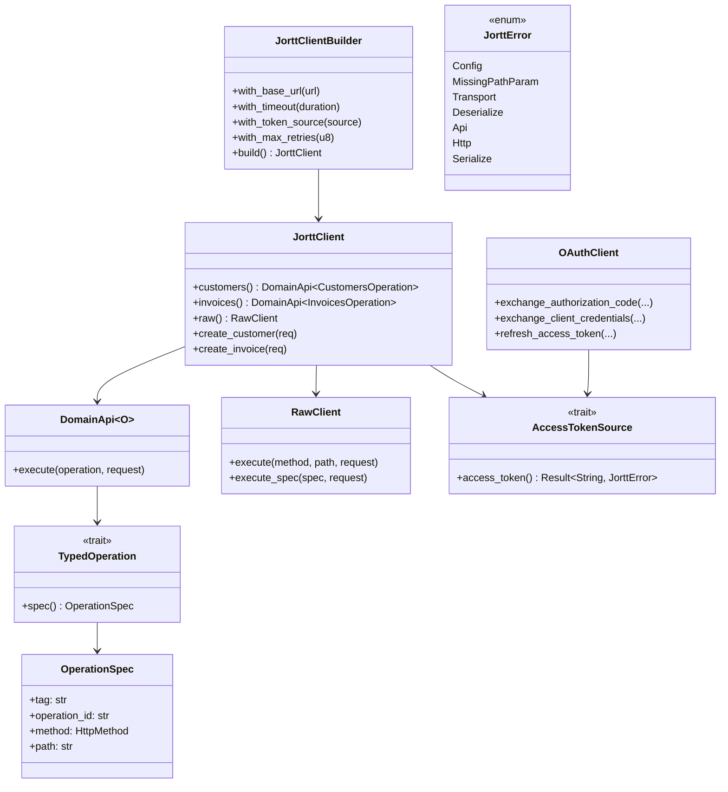

# Class Diagram

```mermaid
classDiagram
    class JorttClientBuilder {
        +with_base_url(url)
        +with_timeout(duration)
        +with_token_source(source)
        +with_max_retries(u8)
        +build() JorttClient
    }

    class JorttClient {
        +customers() DomainApi~CustomersOperation~
        +invoices() DomainApi~InvoicesOperation~
        +raw() RawClient
        +create_customer(req)
        +create_invoice(req)
    }

    class DomainApi~O~ {
        +execute(operation, request)
    }

    class TypedOperation {
        <<trait>>
        +spec() OperationSpec
    }

    class OperationSpec {
        +tag: str
        +operation_id: str
        +method: HttpMethod
        +path: str
    }

    class RawClient {
        +execute(method, path, request)
        +execute_spec(spec, request)
    }

    class AccessTokenSource {
        <<trait>>
        +access_token() Result~String, JorttError~
    }

    class OAuthClient {
        +exchange_authorization_code(...)
        +exchange_client_credentials(...)
        +refresh_access_token(...)
    }

    class JorttError {
        <<enum>>
        Config
        MissingPathParam
        Transport
        Deserialize
        Api
        Http
        Serialize
    }

    JorttClientBuilder --> JorttClient
    JorttClient --> DomainApi~O~
    DomainApi~O~ --> TypedOperation
    TypedOperation --> OperationSpec
    JorttClient --> RawClient
    JorttClient --> AccessTokenSource
    OAuthClient --> AccessTokenSource
```
