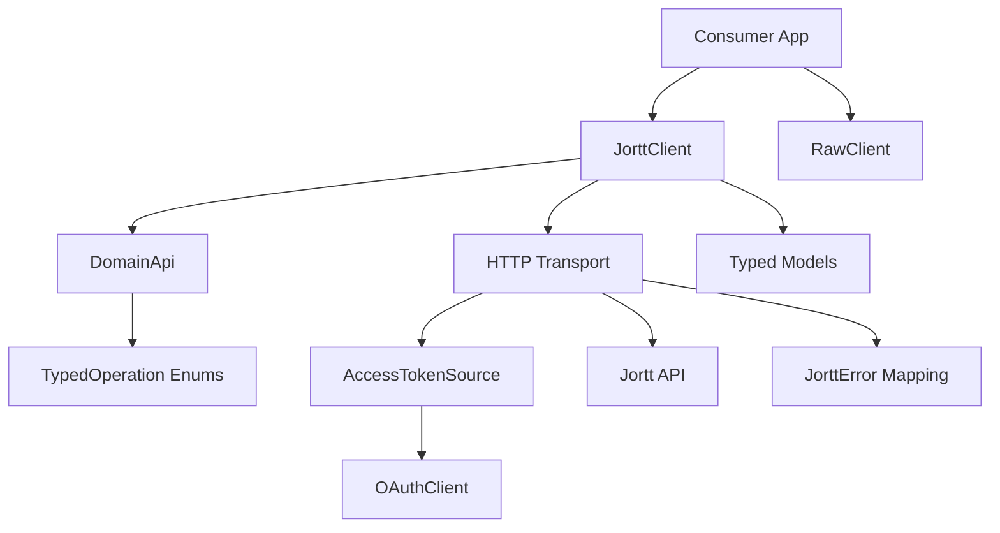

# Component Diagram

```mermaid
graph TD
    App["Consumer App"] --> Client["JorttClient"]
    App --> Raw["RawClient"]
    Client --> Domain["DomainApi<O>"]
    Domain --> Ops["TypedOperation Enums"]
    Client --> Transport["HTTP Transport"]
    Transport --> Token["AccessTokenSource"]
    Transport --> Api["Jortt API"]
    Token --> OAuth["OAuthClient"]
    Client --> Models["Typed Models"]
    Transport --> Errors["JorttError Mapping"]
```
