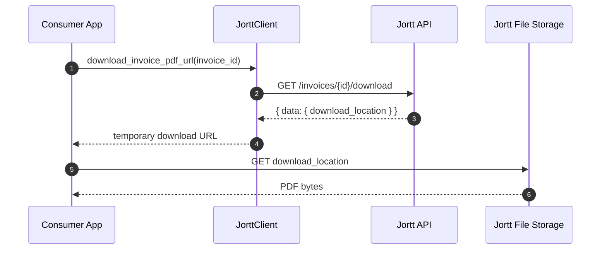

# Sequence - Invoice PDF Download

```mermaid
sequenceDiagram
    autonumber
    participant App as Consumer App
    participant Client as JorttClient
    participant API as Jortt API
    participant Files as Jortt File Storage

    App->>Client: download_invoice_pdf_url(invoice_id)
    Client->>API: GET /invoices/{id}/download
    API-->>Client: { data: { download_location } }
    Client-->>App: temporary download URL
    App->>Files: GET download_location
    Files-->>App: PDF bytes
```
