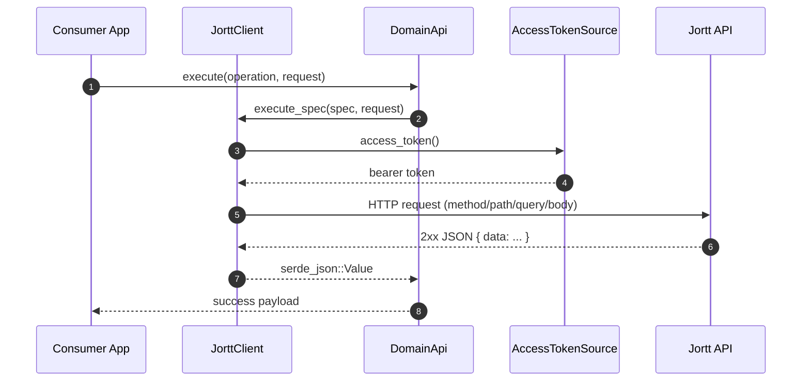

# Sequence - Standard Request

```mermaid
sequenceDiagram
    autonumber
    participant App as Consumer App
    participant Client as JorttClient
    participant Domain as DomainApi
    participant Token as AccessTokenSource
    participant API as Jortt API

    App->>Domain: execute(operation, request)
    Domain->>Client: execute_spec(spec, request)
    Client->>Token: access_token()
    Token-->>Client: bearer token
    Client->>API: HTTP request (method/path/query/body)
    API-->>Client: 2xx JSON { data: ... }
    Client-->>Domain: serde_json::Value
    Domain-->>App: success payload
```
