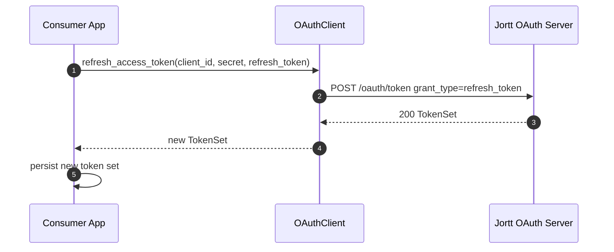

# Sequence - Token Refresh Flow

```mermaid
sequenceDiagram
    autonumber
    participant App as Consumer App
    participant OAuth as OAuthClient
    participant Auth as Jortt OAuth Server

    App->>OAuth: refresh_access_token(client_id, secret, refresh_token)
    OAuth->>Auth: POST /oauth/token grant_type=refresh_token
    Auth-->>OAuth: 200 TokenSet
    OAuth-->>App: new TokenSet
    App->>App: persist new token set
```
