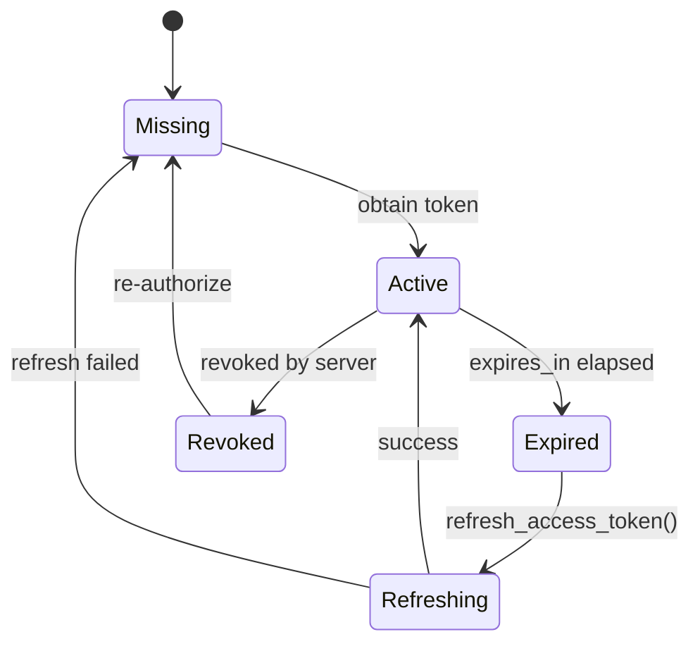

# State Diagram - Token Lifecycle

```mermaid
stateDiagram-v2
    [*] --> Missing
    Missing --> Active: obtain token
    Active --> Expired: expires_in elapsed
    Active --> Revoked: revoked by server
    Expired --> Refreshing: refresh_access_token()
    Refreshing --> Active: success
    Refreshing --> Missing: refresh failed
    Revoked --> Missing: re-authorize
```
